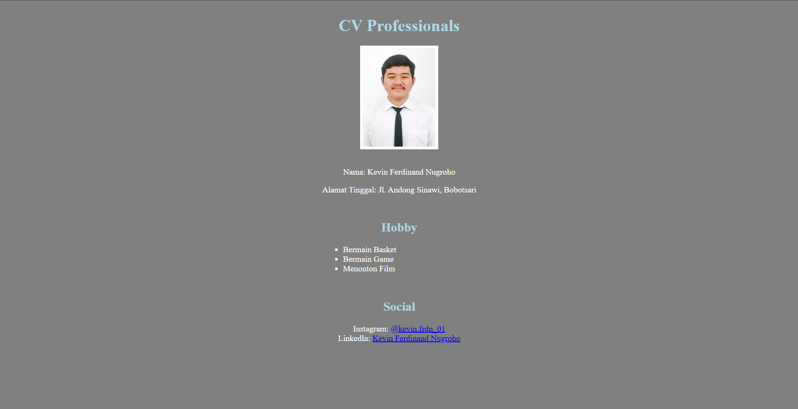

# TUGAS PENDAHULUAN / TUGAS UNGUIDED
# PEMROGRAMAN PERANGKAT BERGERAK

<br>

<div align="center">

# MODUL 01
## HTML CV WITH CSS

<br>

**Disusun Oleh :**

**Kevin Ferdinand Nugroho**  
**NIM: 103122400003**  
**Kelas: SE-08-01**

<br>

**Asisten Praktikum :**  
Abu Abdirrahman Humaid Al-Atsary  
Hamka Zainul Ardhi
<br>

**Dosen Pengampu :**  
Arif Amrullah, S.Kom., M.Kom.

<br>

**PROGRAM STUDI S1 SOFTWARE ENGINEERING**  
**FAKULTAS INFORMATIKA**  
**TELKOM UNIVERSITY PURWOKERTO**  
**2026**

</div>

---

# A. SOAL

Membuat halaman Curriculum Vitae (CV) menggunakan HTML yang telah diberikan dan menerapkan CSS untuk mengatur tampilan halaman agar lebih rapi, terstruktur, dan responsif.

# B. JAWABAN

## 1. Source Code

### a. `index.html`

```html
<!DOCTYPE html>
<html lang="en">
    <h1 class="judul">CV Professionals</h1>
    <body class="container">
    <link rel="stylesheet" href="style.css">
     <br>
    <div class="table">
            <p>Nama:
            Kevin Ferdinand Nugroho </p>
            <p>Alamat Tinggal:
            Jl. Andong Sinawi, Bobotsari
            </p>
            <h2>Hobby</h2>
            <ul>
                <li>Bermain Basket</li>
                <li>Bermain Game</li>
                <li>Menonton Film</li>
            </ul>
            <h2>Social</h2>
            Instagram: <a href="https://www.instagram.com/kevin.frdn_01/">@kevin.frdn_01</a> <br>
            Linkedln: <a href="https://www.linkedin.com/in/kevin-ferdinand-nugroho-171347327/">Kevin Ferdinand Nugroho</a> <br>
        </div>
    </body>
</html>
```

### b. `styles.css`

```css
* body {
    background-color: grey;
}
.judul{
    text-align: center;
    color: lightblue;
    margin-bottom: 20px;
}
h2{
    color: lightblue;
    text-align: left;
    margin-top: 50px;
}
.table {
    color: white;
}

ul{
    list-style-type: square;
    text-align: left;
}
.table h2{
    color: lightblue;
    text-align: center;
}
.container {
    display: flex;
    flex-direction: column;
    align-items: center;
    text-align: center;
}
```

## 2. Screenshot Output

> **Lampirkan screenshot hasil/output program di bagian ini.**



## 3. Deskripsi Program

Program yang dibuat merupakan halaman Curriculum Vitae (CV) menggunakan HTML dan CSS. HTML digunakan untuk membangun struktur halaman yang terdiri dari informasi profil, Tempat tinggal, Hobby dan Social, kemudian program ini menggunakan CSS dengan file yang bernama style.css, agar cv tidak terasa hambar

---

## Struktur Folder Project

```text
103122400003_Kevin Ferdinand Nugroho/
└── TUGAS-1-Web-CV-with-HTML-CSS/
    ├── cv.html
    ├── Kepin Rapi.jpg
    ├── README.md
    └── style.css
```