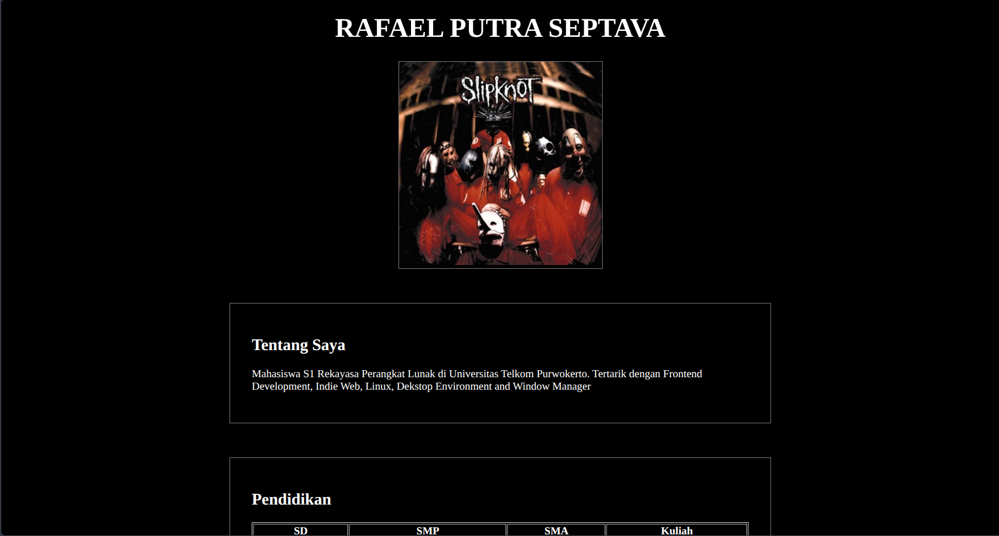
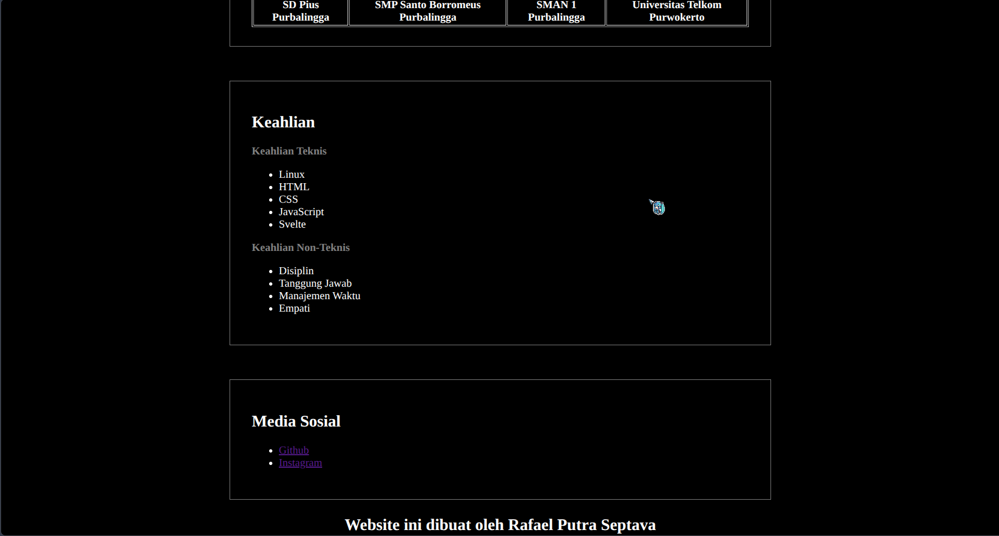
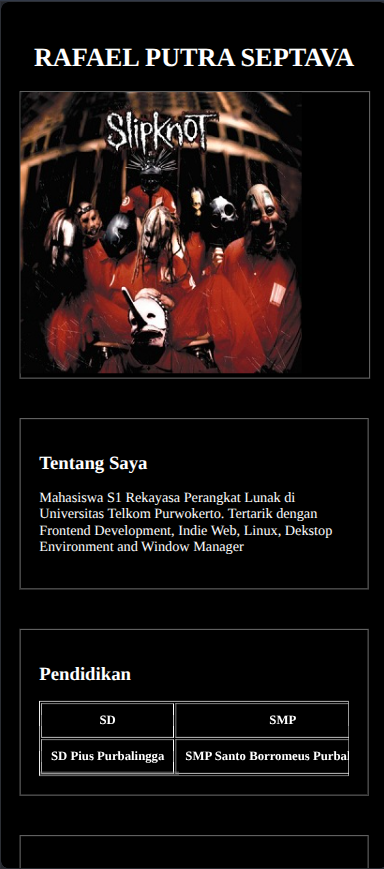

# Tugas Pendahuluan

# Pengembangan dan Perancangan Website

<br>

# Modul 01

## HTML CV with CSS

**Disusun Oleh :**

**Rafael Putra Septava**  
**103122400015**  
**SE-08-01**

<br>

**Asisten Praktikum :**  
Abu Abdirrahman Humaid Al-Atsary  
Hamka Zainul Ardhi
<br>

**Dosen Pengampu :**  
Arif Amrullah, S.Kom., M.Kom.

<br>

**PROGRAM STUDI S1 SOFTWARE ENGINEERING**  
**FAKULTAS INFORMATIKA**  
**TELKOM UNIVERSITY PURWOKERTO**  
**2026**

<br>

## Source Code

### index.html

```
<!DOCTYPE html>
<html lang="en">

<head>
    <meta charset="UTF-8">
    <meta name="viewport" content="width=device-width, initial-scale=1.0">
    <title>Rafael Putra Septava</title>
    <link rel="stylesheet" href="style.css">
</head>

<body>
    <header>
        <h1>RAFAEL PUTRA SEPTAVA</h1>
    </header>

    <main>
        <figure>
            
        </figure>
        <br>
        <section>
            <h2>Tentang Saya</h2>
            <p>Mahasiswa S1 Rekayasa Perangkat Lunak di Universitas Telkom Purwokerto. Tertarik dengan Frontend
                Development, Indie Web, Linux, Dekstop Environment and Window Manager</p>
        </section>
        <br>
        <section>
            <h2>Pendidikan</h2>
            <table border="1">
                <tr>
                    <th>SD</th>
                    <th>SMP</th>
                    <th>SMA</th>
                    <th>Kuliah</th>
                </tr>
                <tr>
                    <th>SD Pius Purbalingga</th>
                    <th>SMP Santo Borromeus Purbalingga</th>
                    <th>SMAN 1 Purbalingga</th>
                    <th>Universitas Telkom Purwokerto</th>
                </tr>
            </table>
        </section>
        <br>
        <section>
            <h2>Keahlian</h2>

            <h3>Keahlian Teknis</h3>
            <ul>
                <li>Linux</li>
                <li>HTML</li>
                <li>CSS</li>
                <li>JavaScript</li>
                <li>Svelte</li>
            </ul>
            <h3>Keahlian Non-Teknis</h3>
            <ul>
                <li>Disiplin</li>
                <li>Tanggung Jawab</li>
                <li>Manajemen Waktu</li>
                <li>Empati</li>
            </ul>
        </section>
        <br>
        <section>
            <h2>Media Sosial</h2>
            <ul>
                <li>
                    <a href="https://github.com/RafaelSeptava?tab=repositories">Github</a>
                </li>
                <li>
                    <a href="https://www.instagram.com/rafaelseptava/">Instagram</a>
                </li>
            </ul>
        </section>
    </main>

    <footer>
        <h3>Website ini dibuat oleh Rafael Putra Septava</h3>
    </footer>

</body>

</html>
```

### style.css

```
/* Desktop */

body {
  background-color: black;
  color: white;
  padding: 2rem 1rem;
}

main {
  max-width: 800px;
  margin: 0 auto;
  display: flex;
  flex-direction: column;
  gap: 1rem;
}

header {
  text-align: center;
}

header h1 {
  font-size: 2.5rem;
  font-weight: 700;
  color: white;
}

figure {
  margin: 0 auto;
  border: 1px solid gray;
}
figure:hover {
  border-color: white;
}

section,
form {
  background: black;
  border: 1px solid gray;
  padding: 1.75rem 2rem;
}

section:hover,
form:hover {
  border-color: white;
}

h2 {
  font-size: 1.5rem;
  color: white;
}

h3 {
  font-size: 1rem;
  color: gray;
}

footer {
  text-align: center;
}

footer h3 {
  font-size: 1.5rem;
  font-weight: 700;
  color: white;
}

/* Mobile */
@media (max-width: 600px) {
  body {
    padding: 1rem 0.75rem;
  }

  main {
    width: 100%;
    gap: 0.75rem;
  }

  header {
    margin-bottom: 1rem;
  }

  header h1 {
    font-size: 1.75rem;
    line-height: 1.2;
  }

  figure {
    width: 100%;
  }

  section {
    padding: 1.25rem;
  }

  h2 {
    font-size: 1.25rem;
  }

  h3 {
    font-size: 0.95rem;
  }

  section p {
    font-size: 0.95rem;
  }

  table {
    display: block;
    overflow-x: auto;
    white-space: nowrap;
    font-size: 0.85rem;
  }

  th,
  td {
    padding: 0.6rem;
  }

  ul {
    padding-left: 1.25rem;
  }

  li {
    font-size: 0.95rem;
  }

  footer {
    margin-top: 1.5rem;
  }

  footer h3 {
    font-size: 1rem;
  }
}
```

## Screenshot




## Deskripsi Program
Pada bagian HTML menyusun informasi secara terstruktur dimulai dari foto profil, bagian 'Tentang Saya', 'Pendidikan', 'Keahlian' dari yang non-teknis dan teknis, dan Media Sosial. Saya menggunakan Semantic HTML seperi 'figure' untuk bagian foto profil, 'section' untuk bagian konten, dan 'main' sebagai pembungkus figure dan section.

Pada bagian CSS menggunakan tema gelap yang minimalis tetapi modern. Serta dilengkapi dengan responsive design menggunakan media query untuk mobile. Hal ini membuat tampilan menyesuaikan antara dekstop dan juga mobile.