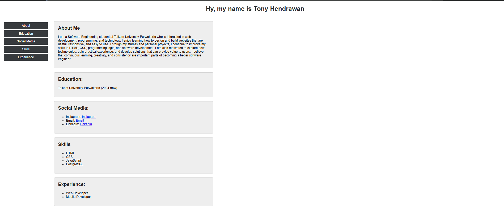

  

**Nama:** Tony Hendrawan  
**NIM:** 103122400021  
**Kelas:** SE-08-01  
Pengembangan dan Perancangan Web  
Telkom University Purwokerto

 

  <strong>LAPORAN PRAKTIKUM PENGEMBANGAN DAN PERANCANGAN WEB</strong>

  CV Sederhana Menggunakan HTML dan CSS

- **Pertemuan:** Week 3
- **Topik:** Pembuatan CV HTML dan CSS

## Source Code

- [HTML (`index.html`)](../Source%20Code/index.html)
- [CSS (`style.css`)](../Source%20Code/style.css)

## Output

  

