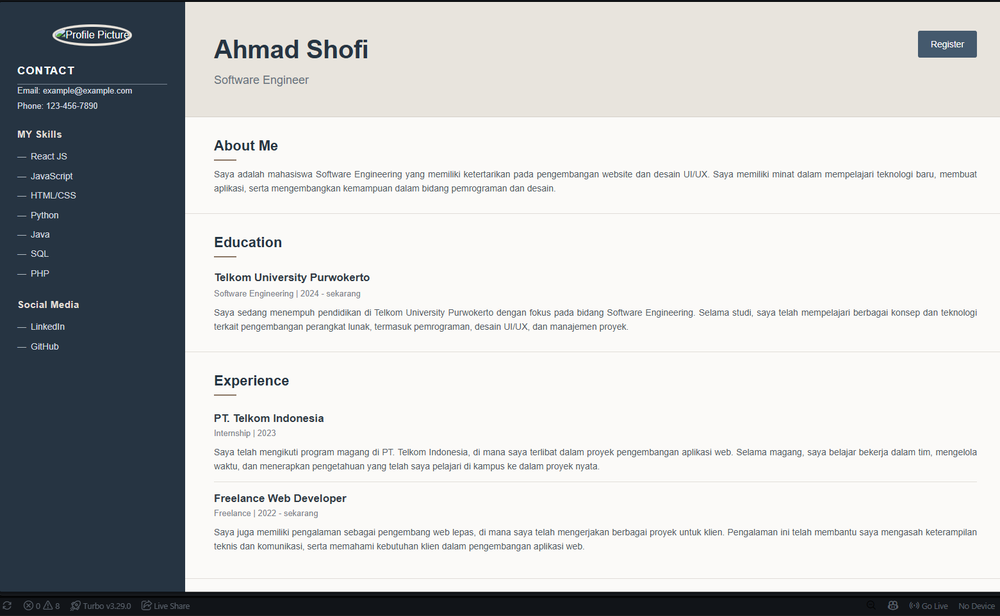

# LAPORAN PRAKTIKUM TUGAS 1 - HTML & CSS
**Mata Kuliah Pemrograman Web**

---

### **Identitas Mahasiswa**
* **Nama:** Ahmad Shofi  
* **NIM:** 103122400024  
* **Kelas / Program Studi:** S1 Rekayasa Perangkat Lunak
* **Universitas:** Telkom University Purwokerto  

---

## A. Tujuan Praktikum
1. Mahasiswa mampu memahami dan menerapkan struktur dasar dokumen HTML5 secara terstruktur dan semantik.
2. Mahasiswa mampu menguasai penggunaan CSS (Cascading Style Sheets) untuk mengatur tata letak (*layout*), warna, tipografi, dan estetika antarmuka web.
3. Mengaplikasikan teknik tata letak modern seperti **Flexbox** serta **Media Queries** agar halaman web bersifat responsif (*responsive design*) di berbagai ukuran layar perangkat.
4. Membangun halaman Curriculum Vitae (CV) profil pribadi yang interaktif, profesional, dan dilengkapi dengan halaman formulir registrasi pendukung.

---

## B. Penjelasan Source Code & Arsitektur Proyek

Proyek tugas ini terdiri dari beberapa komponen file utama yang saling terhubung:

### 1. `index.html` (Struktur Dokumen Web)
* **`<!DOCTYPE html>` & `<html lang="en">`**: Mendefinisikan dokumen sebagai HTML5 dengan bahasa utama bahasa Inggris.
* **Bagian `<head>`**: Memuat konfigurasi meta karakter UTF-8, pengaturan *viewport* untuk responsivitas perangkat mobile, tautan ke file eksternal `style.css` dan `script.js`, serta judul halaman (*Title*).
* **Bagian Sidebar (`<aside class="container">`)**: Berisi komponen identitas visual, meliputi foto profil bulat (*circular image*), informasi kontak (*email, phone*), daftar keahlian utama (*my skills* seperti React JS, JavaScript, HTML/CSS, Python, Java, SQL, PHP), serta tautan media sosial profesional (LinkedIn dan GitHub).
* **Bagian Konten Utama (`<main class="content">`)**: 
  * **Header**: Menampilkan nama lengkap pemilik CV, profesi (*Software Engineer*), serta tombol interaktif menuju halaman registrasi (`register.html`).
  * **About Me**: Paragraf naratif ringkas mengenai latar belakang sebagai mahasiswa *Software Engineering* dan ketertarikan pada pengembangan web.
  * **Education**: Menampilkan riwayat pendidikan formal di Telkom University Purwokerto dengan rentang waktu studi.
  * **Experience**: Menjelaskan pengalaman kerja atau magang (seperti di PT. Telkom Indonesia dan pengalaman sebagai *Freelance Web Developer*).
  * **Projects**: Memaparkan portofolio proyek yang pernah dikerjakan, seperti situs *E-commerce* dan *Portfolio Website*.

### 2. `style.css` (Desain & Styling Antarmuka)
* **Reset & Global Styling**: Mengatur margin, padding, dan `box-sizing: border-box` secara global untuk konsistensi tampilan lintas peramban, serta mengaktifkan guliran halus (`scroll-behavior: smooth`).
* **Flexbox Layout**: Menggunakan properti `display: flex` pada kontainer utama untuk membagi tata letak halaman secara horizontal antara *sidebar* navigasi di sebelah kiri dan *main content* di sebelah kanan.
* **Efek Interaktif & Animasi**: 
  * Menerapkan transisi halus (`transition: 0.3s ease`) pada gambar profil dan tautan saat kursor diarahkan (*hover effects*).
  * Menggunakan animasikeyframes kustom (`headerEnter`, `sectionEnter`, dan `formEnter`) untuk memberikan efek transisi masuk (*fade/translate*) yang dinamis saat halaman dimuat.
* **Responsivitas (Media Queries)**: 
  * Menggunakan aturan `@media (max-width: 800px)` dan `@media (max-width: 500px)` untuk mengubah arah flexbox menjadi vertikal (kolom tunggal) secara otomatis ketika diakses melalui perangkat layar kecil seperti *smartphone* atau *tablet*.

### 3. Watermark Identitas
Seluruh kode sumber (*source code*) dan laporan praktikum ini telah diberi tanda kepemilikan atas nama **Ahmad Shofi** dengan NIM **103122400024** sebagai bentuk otentisitas pengerjaan tugas mandiri.

---

## C. Screenshot Hasil Tampilan

> *(Simpan file tangkapan layar/screenshot hasil running web CV Anda di dalam folder yang sama dengan nama `screenshot-cv.png`)*

---

## D. Kesimpulan
Praktikum ini berhasil diselesaikan dengan mengimplementasikan konsep dasar hingga menengah pengembangan web menggunakan HTML5 dan CSS. Melalui penerapan *Flexbox* dan *Media Queries*, antarmuka CV profil pribadi yang dibangun tidak hanya estetis secara visual tetapi juga sangat adaptif dan responsif terhadap berbagai ukuran layar perangkat.

---
*© 2026 Ahmad Shofi - 103122400024*