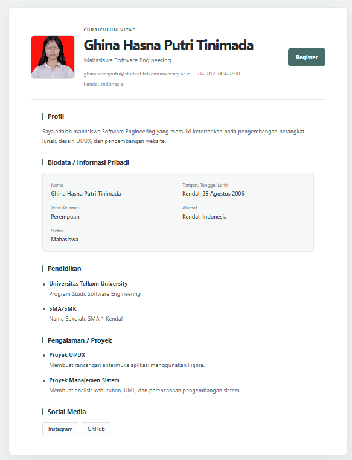
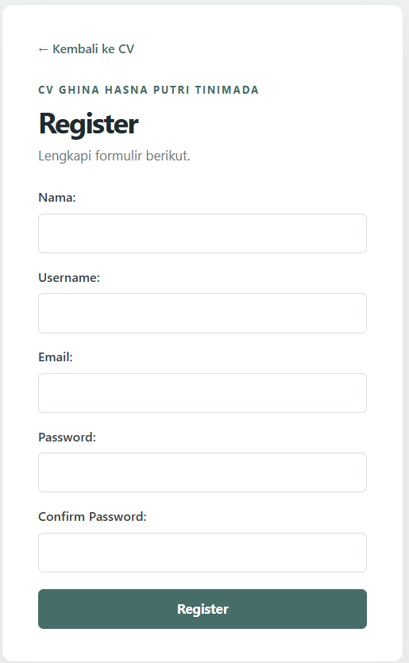

# TUGAS PENDAHULUAN / TUGAS UNGUIDED

# PEMROGRAMAN PERANGKAT BERGERAK

<div align="center">

# MODUL 01

## HTML CV WITH CSS

<br>

**Disusun Oleh :**

**Ghina Hasna Putri Tinimada**

**NIM: 103122400031**

**Kelas: SE-08-01**

<br>

**Asisten Praktikum :**

Abu Abdirrahman Humaid Al-Atsary

Hamka Zainul Ardhi

<br>

**Dosen Pengampu :**

Arif Amrullah, S.Kom., M.Kom.

<br>

**PROGRAM STUDI S1 SOFTWARE ENGINEERING**

**FAKULTAS INFORMATIKA**

**TELKOM UNIVERSITY PURWOKERTO**

**2026**

</div>

---

## 1. Deskripsi Program

Program ini merupakan website Curriculum Vitae (CV) sederhana yang dibuat menggunakan HTML dan CSS. Website ini menampilkan informasi pribadi, profil singkat, pendidikan, pengalaman atau proyek, kontak, dan media sosial. Website juga menyediakan halaman Register yang berisi formulir pendaftaran.

## 2. Struktur Folder

```text
HTML-CV-WITH-CSS/
├── index.html
├── register.html
├── styles.css
├── fotocv.jpeg
└── README.md
```

Keterangan:

* `index.html`: Menampilkan halaman utama CV.
* `register.html`: Menampilkan formulir pendaftaran.
* `styles.css`: Mengatur tampilan dan tata letak website.
* `fotocv.jpeg`: Menyimpan foto profil yang ditampilkan pada halaman CV.
* `README.md`: Berisi dokumentasi program dan petunjuk penggunaan.

## 3. Deskripsi File Program

### A. `index.html`

File `index.html` digunakan untuk membuat struktur halaman utama CV. Halaman ini berisi foto profil, nama, status sebagai mahasiswa Software Engineering, informasi kontak, profil, biodata, pendidikan, pengalaman atau proyek, serta tautan media sosial. Halaman ini juga menyediakan tombol Register untuk membuka halaman pendaftaran.

### B. `styles.css`

File `styles.css` digunakan untuk mengatur tampilan website agar terlihat rapi dan menarik. Pengaturan meliputi warna, jenis huruf, ukuran elemen, jarak antarbagian, tombol, formulir, dan tata letak. File ini juga menggunakan media query agar tampilan website dapat menyesuaikan ukuran layar komputer maupun ponsel.

### C. `register.html`

File `register.html` digunakan untuk membuat halaman pendaftaran yang berisi formulir nama, username, email, password, dan konfirmasi password. Halaman ini dilengkapi tombol Register dan tautan untuk kembali ke halaman CV.


## 4. Teknologi yang Digunakan

* **HTML5:** Membuat struktur dan isi halaman website.
* **CSS3:** Mengatur desain, warna, tata letak, dan responsivitas website.

## 6. Hasil Program

Program menghasilkan website CV yang menampilkan informasi pribadi dengan tata letak yang rapi. Pengguna dapat melihat informasi CV, membuka tautan media sosial, serta berpindah ke halaman Register melalui tombol yang tersedia.

## 7. Screenshot Hasil Program



## 8. Kesimpulan
Program ini menerapkan HTML untuk membuat struktur halaman CV dan formulir pendaftaran, serta CSS untuk mengatur tampilan, warna, tata letak, dan responsivitas website. Penerapan HTML menggunakan elemen seperti heading, paragraf, daftar, tautan, gambar, dan formulir, sedangkan CSS menggunakan selector, Flexbox, Grid, dan media query untuk mengatur tampilan website.